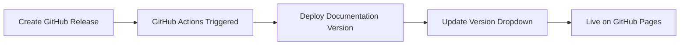

# Release Management & Documentation Versioning

This guide explains how to create releases that automatically generate documentation versions tied to your product releases.

## 🎯 Overview

Your documentation versioning is now fully automated and tied to GitHub releases:
- **Create a GitHub release** → **Documentation version is automatically created**
- **Release notes** become part of the version description
- **Version dropdown** is automatically updated
- **No manual deployment** required

## 🚀 How It Works

### Automatic Workflow


### Triggers
- **Main Branch Push**: Updates "latest" version
- **GitHub Release Published**: Creates new versioned documentation
- **Pull Request**: Builds preview (no deployment)

## 📋 Creating a Release

### Step 1: Prepare Your Release
```bash
# Ensure main branch is ready
git checkout main
git pull origin main

# Make sure all changes are committed
git status
```

### Step 2: Create GitHub Release
1. **Go to your repository**: https://github.com/manikantesh/finopsoptimizer
2. **Click "Releases"** in the right sidebar
3. **Click "Create a new release"**

### Step 3: Fill Release Information

#### **Tag Version**
```
v2.2.0
```
- Use semantic versioning (v2.2.0, v2.2.1, etc.)
- The 'v' prefix is optional (will be removed automatically)

#### **Release Title**
```
v2.2.0 - Enhanced AI Agents & Performance Improvements
```

#### **Release Description**
```markdown
## 🚀 New Features
- Enhanced AI agent capabilities with improved cost predictions
- Real-time dashboard performance optimizations
- New Oracle Cloud cost optimization features

## 🔧 Improvements
- Faster pricing engine with 50% better response times
- Improved error handling and logging
- Enhanced security features

## 🐛 Bug Fixes
- Fixed version selector display issues
- Resolved pricing calculation edge cases
- Improved mobile responsiveness

## 📚 Documentation
- Updated AI agents guide with new examples
- Enhanced troubleshooting section
- Added performance optimization tips

---
**Full Changelog**: https://github.com/manikantesh/finopsoptimizer/compare/v2.1.0...v2.2.0
```

### Step 4: Publish Release
- **Check "Set as the latest release"** if this is your newest version
- **Click "Publish release"**

## ⚡ What Happens Automatically

### 1. GitHub Actions Triggered
```yaml
# Workflow automatically runs when release is published
on:
  release:
    types: [published]
```

### 2. Documentation Deployed
```bash
# Version extracted from release tag
VERSION=2.2.0  # (v prefix removed)

# Documentation deployed to versioned URL
mike deploy --push --update-aliases 2.2.0
```

### 3. Version Dropdown Updated
```json
{
  "version": "2.2.0",
  "title": "2.2.0 - Enhanced AI Agents & Performance Improvements",
  "aliases": []
}
```

### 4. Live in 2-3 Minutes
- **New version available**: https://manikantesh.github.io/finopsoptimizer/2.2.0/
- **Version dropdown updated**: Shows new version in selector
- **Automatic default**: Latest release becomes default if specified

## 📊 Version Management

### Version URLs
```
Latest (Development): /latest/
Release v2.2.0:      /2.2.0/
Release v2.1.0:      /2.1.0/
Release v2.0.0:      /2.0.0/
```

### Version Dropdown Display
```
Latest (Development)
2.2.0 - Enhanced AI Agents & Performance Improvements
2.1.0 - AI Agents & Real-time Dashboards  
2.0.0 - Multi-Cloud Support
```

## 🎨 Best Practices

### Release Naming
```bash
# Good examples
v2.1.0 - AI Agents & Real-time Dashboards
v2.1.1 - Bug Fixes & Performance Improvements
v2.2.0 - Oracle Cloud Integration

# Avoid
v2.1.0
Release 2.1.0
Version 2.1.0
```

### Release Descriptions
- **Start with key features** (first line becomes version description)
- **Use clear sections** (🚀 New Features, 🔧 Improvements, 🐛 Bug Fixes)
- **Include links** to documentation or changelog
- **Keep first line concise** (appears in version dropdown)

### Semantic Versioning
```
MAJOR.MINOR.PATCH (e.g., 2.1.0)

MAJOR: Breaking changes
MINOR: New features (backward compatible)
PATCH: Bug fixes (backward compatible)
```

## 🔧 Advanced Configuration

### Pre-release Versions
```yaml
# For beta/alpha releases
v2.2.0-beta.1
v2.2.0-alpha.1
v2.2.0-rc.1
```

### Release Branches
```bash
# Create release branch for major versions
git checkout -b release/v2.2.0
git push origin release/v2.2.0

# Create release from branch
# GitHub Release → Target: release/v2.2.0
```

## 📈 Monitoring Releases

### GitHub Actions
1. **Go to Actions tab** in your repository
2. **Check "Deploy Documentation" workflow**
3. **Verify successful deployment**

### Version Verification
```bash
# Check deployed versions
mike list

# Expected output:
# latest [main]
# 2.2.0
# 2.1.0
# 2.0.0
```

### Live Site Check
1. **Visit**: https://manikantesh.github.io/finopsoptimizer/
2. **Check version dropdown**: Should show new version
3. **Test version switching**: Verify all versions work

## 🚨 Troubleshooting

### Release Not Creating Version
1. **Check GitHub Actions logs**
2. **Verify release is "published" (not draft)**
3. **Ensure tag follows version format**

### Version Not in Dropdown
1. **Check versions.json** was updated
2. **Clear browser cache**
3. **Wait 2-3 minutes** for deployment

### Deployment Failures
```bash
# Check workflow logs in GitHub Actions
# Common issues:
- Invalid tag format
- Git configuration issues
- Permission problems
```

## 📋 Release Checklist

### Before Release
- [ ] All features tested and working
- [ ] Documentation updated
- [ ] CHANGELOG.md updated
- [ ] Version numbers updated in code
- [ ] All tests passing

### Creating Release
- [ ] Use semantic versioning (v2.2.0)
- [ ] Write clear release title
- [ ] Include comprehensive release notes
- [ ] Set as latest release (if applicable)
- [ ] Publish release

### After Release
- [ ] Verify GitHub Actions completed successfully
- [ ] Check new version appears in dropdown
- [ ] Test version switching functionality
- [ ] Verify documentation is accurate for the release

## 🎯 Example Release Workflow

### Monthly Release Cycle
```bash
# Week 1-3: Development
git checkout main
# ... develop features ...
git commit -m "feat: add new AI agent capabilities"
git push origin main

# Week 4: Release preparation
git checkout -b release/v2.2.0
# ... final testing and documentation updates ...
git push origin release/v2.2.0

# Release day: Create GitHub release
# 1. Go to GitHub → Releases → New release
# 2. Tag: v2.2.0
# 3. Title: v2.2.0 - Enhanced AI Agents
# 4. Description: Detailed release notes
# 5. Publish release

# Automatic: Documentation deployed in 2-3 minutes
```

## 🔮 Future Enhancements

### Planned Features
- **Release notes integration** in documentation
- **Version comparison** pages
- **Automated changelog** generation
- **Release metrics** and analytics

---

**Your documentation versioning is now fully automated and professional!** 🚀

Simply create GitHub releases and watch your documentation versions appear automatically in the dropdown selector.